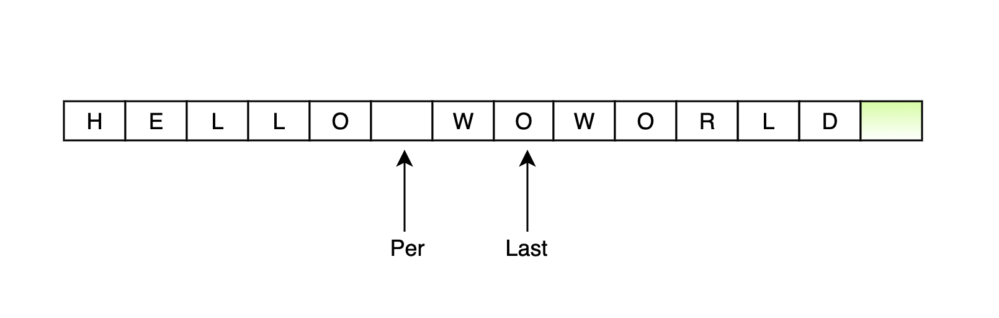
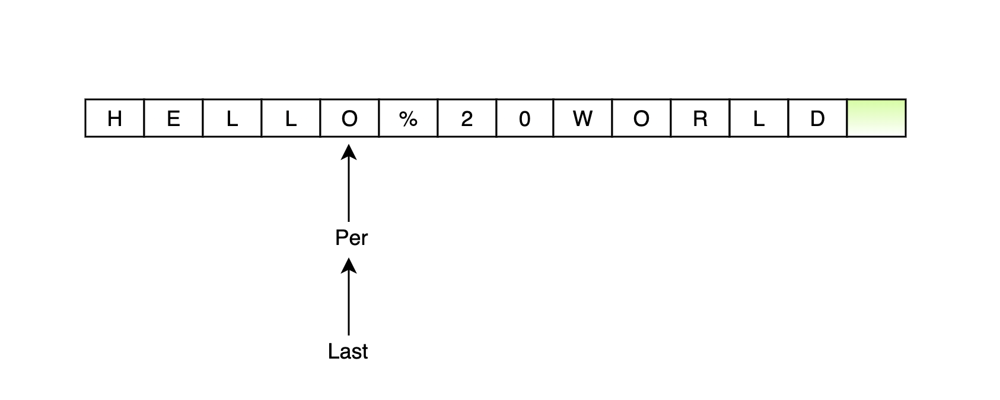
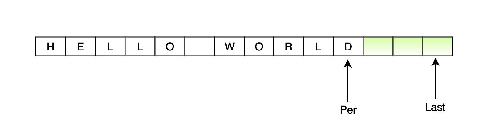
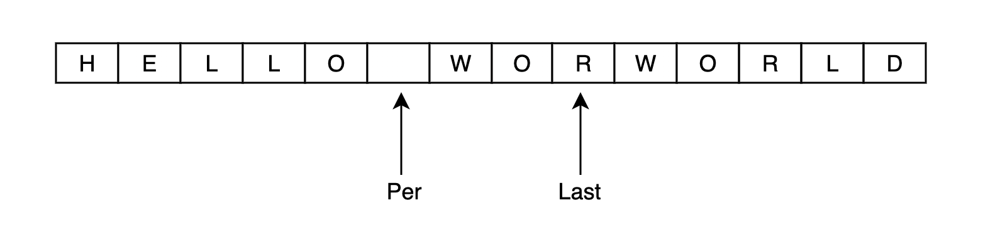
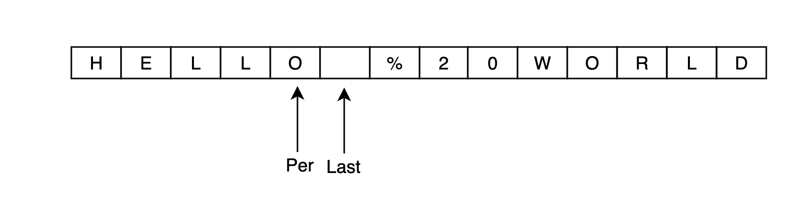
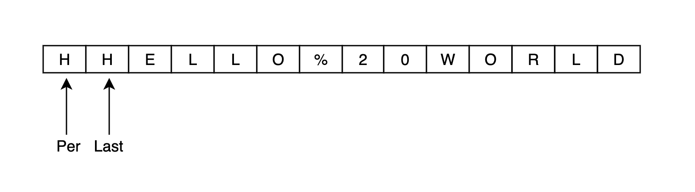

[[toc]]

# 题目
```
URL化。编写一种方法，将字符串中的空格全部替换为%20。假定该字符串尾部有足够的空间存放新增字符，并且知道字符串的“真实”长度。（注：用Java实现的话，请使用字符数组实现，以便直接在数组上操作。）

来源：力扣（LeetCode）
链接：https://leetcode-cn.com/problems/string-to-url-lcci
```

# 无需额外空间，Java的两种 O(n) 解法

- 首先分析题意，可以发现``给定字符串尾部有足够的空间``,并且 Java 实现要求使用``字符数组``，也就是说避免使用 ``String`` 相关替换字符 API，否则也失去了题目的意义。
- 其次，可以发现，``空格``在字符串中的位置是随机的，将``空格``替换为``%20``后，可以发现，每替换一个``空格``，数组的长度就会增加 2 位。
- 最后，数组中间如果插入字符，就需要将后续的字符向后移动，因为不确定有多少个空格，字符的移动就会重复多次，所以，我们可以考虑直接计算出数组替换完成后的长度，从后向前替换，确保每个字符可以一次性复制到相应的位置。

# 方案一：双指针
- 依据上述分析，我们从数组的最后开始复制和替换。
1. 首先准备两个指针，pre指针指向原始数组末尾，last指针指向替换后的数组末尾。如图：


2. 同时向前移动两个指针，将 pre 指针对应的字符复制到 last 指针对应的位置，直到pre指针碰到空格为止，如图：


3. 当pre指针指向空格时，将pre指针向前移动 1 位，last 指针向前移动 3 位，依次插入 0、2、%，如图：


4. 当 pre 指针与 last 指针相遇时，说明替换完成。

- 代码如下：
```java
class Solution {
    public String replaceSpaces(String S, int length) {

        // 边界条件
        if(S == null || S.length() == 0) {
            return S;
        }

        // 双指针位置
        int preIndex = length - 1;
        int lastIndex = preIndex;
        for(int i=0; i < length; i++) {
            if(str[i] == ' ') {
                lastIndex +=2;
            }
        }

        // 替换字符串
        while(lastIndex != preIndex) {
            if(str[preIndex] != ' ') {
                // 复制
                str[lastIndex] = str[preIndex];
                lastIndex--;
                preIndex--;
            } else {
                // 替换 0 2 % ; pre-1; last - 3
                str[lastIndex --] = '0';
                str[lastIndex --] = '2';
                str[lastIndex --] = '%';
                preIndex --;
            }
        }

        return String.valueOf(str).trim();
    }
}
```

# 方案二：双指针变形版
- 本质上也是双指针，是方案一的变形版。
- 分析题目，虽然要求操作的是`数组`，但是返回的结果是`字符串`，所以，可以直接字符串`数组最后一位作为 Last 指针`, 替换完成后，直接截取数组生成字符串即可。这样，我们可以省略掉计算 last 指针的一次遍历。

1. 首先准备两个指针，pre 指针指向原始数组末尾，last 指针指向给定字符数组末尾。如图：


2. 同时向前移动两个指针，将 pre 指针对应的字符复制到 last 指针对应的位置，直到pre指针碰到空格为止，如图：


3. 当pre指针指向空格时，将pre指针向前移动 1 位，last 指针向前移动 3 位，依次插入 0、2、%，如图：


4. 重复上述步骤，直到 pre 指针指向数组第一个元素，完成当前元素的复制。如图：


5. 截取出真实长度的字符串即可。

- 代码如下：
```java
class Solution {
    public String replaceSpaces(String S, int length) {

        // 边界条件
        if(S == null || S.length() == 0) {
            return S;
        }

        char [] str = S.toCharArray();
        int index = str.length - 1;
        for(int i=length - 1; i >= 0; i--) {
            if(str[i] == ' ') {
                str[index--] = '0';
                str[index--] = '2';
                str[index--] = '%';
            }else{
                str[index--] = str[i];
            }
        }
        return new String(str, index + 1, str.length - index - 1);
    }
}
```