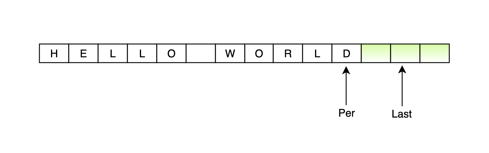

[[toc]]

# 题目
```
URL化。编写一种方法，将字符串中的空格全部替换为%20。假定该字符串尾部有足够的空间存放新增字符，并且知道字符串的“真实”长度。（注：用Java实现的话，请使用字符数组实现，以便直接在数组上操作。）

来源：力扣（LeetCode）
链接：https://leetcode-cn.com/problems/string-to-url-lcci
```

# 无需额外空间，Java的两种 O(n) 解法

- 首先分析题意，可以发现``给定字符串尾部有足够的空间``,并且 Java 实现要求使用``字符数组``，也就是说避免使用 ``String`` 相关替换字符 API，否则也失去了题目的意义。
- 其次，可以发现，``空格``在字符串中的位置是随机的，将``空格``替换为``%20``后，可以发现，每替换一个``空格``，数组的长度就会增加 2 位。
- 最后，数组中间如果插入字符，就需要将后续的字符向后移动，因为不确定有多少个空格，字符的移动就会重复多次，所以，我们可以考虑直接计算出数组替换完成后的长度，从后向前替换，确保每个字符可以一次性复制到相应的位置。

# 方案一：双指针
- 依据上述分析，我们从数组的最后开始复制和替换。
1. 首先准备两个指针，pre指针指向原始数组末尾，last指针指向替换后的数组末尾。如图：



